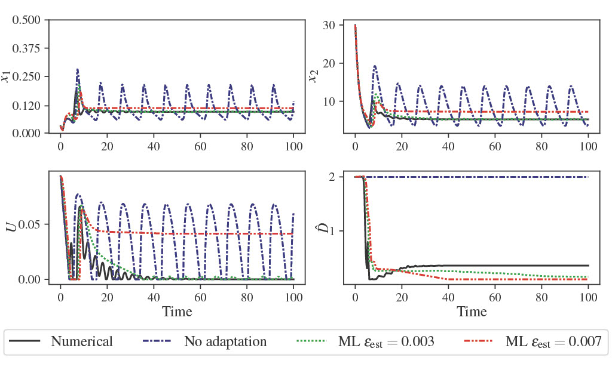

  
  

   

# Delay-adaptive Control of Nonlinear Systems with Approximate Neural Operator Predictors

 

## About this respository
This repository contains the official implementation for paper titled: "Delay-adaptive Control of Nonlinear Systems with Approximate Neural Operator Predictors". The Jupyter-notebook given contains all the required code to replicate the results from the paper. Additionally, we publicly make available our dataset and models on hugging face:
- [Pretrained Models](https://huggingface.co/lukebhan/NeuralOperatorDelayAdaptivePredictorFeedback)
- [Dataset](https://huggingface.co/datasets/lukebhan/NeuralOperatorDelayAdaptivePredictorFeedback)

## Examples
Please see the jupyter-notebook `NOP_approx_predictors_delay_adaptive.ipynb`. All the datasets are available in the repository above, but if one ones to make their own data, the generation code is commented out in the notebook. Likewise to compute one's own models, please comment out the `load_dict` in the notebook.

Additionally, to run the notebook, this code requires the following packges:
- [DeepXDE Version 1.9.0](https://github.com/lululxvi/deepxde)
- [PyTorch Vesrion 2.2.2](https://pytorch.org/get-started/locally/)
- [Numpy Version 1.26.4](https://numpy.org/install/)

## Questions or issues
If you have any questions or issues, feel free to reach out to `lbhan@ucsd.edu` or leave an issues on this github. 

## Licensing
 This work is licensed under a <a rel="license" href="http://creativecommons.org/licenses/by-nc-sa/4.0/">Creative Commons Attribution-NonCommercial-ShareAlike 4.0 International License</a>.
